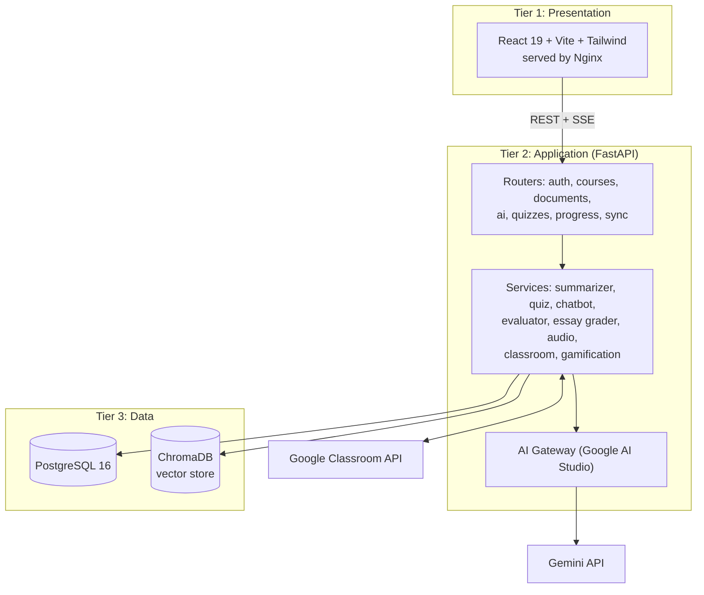
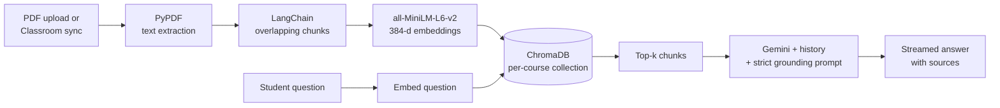

<div align="center">

# 🎓 SQUEE-Learn: MultiAgent AI Teaching Assistant

**An AI-powered study platform that turns your actual lecture material into summaries, quizzes, tutoring, and graded feedback.**

[](https://www.python.org/)
[](https://fastapi.tiangolo.com/)
[](https://react.dev/)
[](https://www.typescriptlang.org/)
[](https://www.postgresql.org/)
[](https://www.docker.com/)
[](https://azure.microsoft.com/)

*Graduation Project · Faculty of Engineering, Alexandria University · Computer & Communication Engineering · 2025–2026*

</div>

<div align="center">

### 🎬 Demo Video

[](https://youtu.be/-egvmEQ0LW0)

</div>

---

## 📖 Table of Contents

- [Overview](#-overview)
- [The Five Agents](#-the-five-agents)
- [Key Features](#-key-features)
- [System Architecture](#-system-architecture)
- [Tech Stack](#-tech-stack)
- [Project Structure](#-project-structure)
- [Getting Started](#-getting-started)
- [API Overview](#-api-overview)
- [Deployment](#-deployment)
- [Testing and Evaluation](#-testing-and-evaluation)
- [Security](#-security)
- [Arabic Language Support](#-arabic-language-support)
- [Roadmap](#-roadmap)
- [Team](#-team)
- [License](#-license)

---

## 🔍 Overview

University students collect lecture slides and PDFs across many platforms, but spend a lot of time summarizing them, quizzing themselves, and checking whether they understood the material. Learning Management Systems like Google Classroom distribute content but offer no intelligent support. General-purpose chatbots are smart but know nothing about *your* course.

**SQUEE-Learn** bridges that gap. It syncs with **Google Classroom**, indexes your real lecture materials, and gives you a set of cooperating AI agents that work on top of them. Answers stay grounded in what your instructor actually taught, thanks to **Retrieval-Augmented Generation (RAG)**.

The name SQUEE comes from its five agents:

| Letter | Agent | What it does |
|:---:|---|---|
| **S** | Summarization Agent | Condenses lectures into structured study notes |
| **Q** | Quiz Generation Agent | Builds configurable multiple-choice quizzes |
| **U** | Understanding (Tutor) Agent | RAG chatbot grounded in your course documents |
| **E** | Evaluator Agent | Scores your own summaries across six quality dimensions |
| **E** | Essay Grading Agent | Predicts IELTS-style band scores with a fine-tuned model |

---

## 🤖 The Five Agents

### 📝 S: Summarization Agent
Accepts pasted text or a stored `document_id` and returns a structured academic summary. It uses a deliberately low temperature to keep the output faithful to the source and reduce hallucination. Gemini's 1M-token context window means most lectures need no chunking.

### ❓ Q: Quiz Generation Agent
Generates multiple-choice quizzes from text and optional learning objectives. Output is requested as strict JSON and validated with Pydantic (question stem, four options, valid answer index) before it is saved. Distractors are written to be plausible but clearly wrong.

### 💬 U: Understanding / RAG Tutor Agent
A conversational tutor scoped to a single course. Questions are embedded with `all-MiniLM-L6-v2`, matched against that course's ChromaDB collection, and answered with the retrieved chunks as context. The last 3 conversation turns are kept for follow-ups, and responses stream token by token over Server-Sent Events. If the answer isn't in the course material, the tutor says so instead of guessing. A general-purpose mode is available when no course is selected.

### ✅ E: Evaluator Agent
Grades a student-written summary against the lecture using a **hybrid** of deterministic NLP metrics (embedding similarity, ROUGE) and LLM judgment, across six dimensions:

`Correctness` · `Relevance` · `Completeness` · `Conciseness` · `Terminology` · `Coherence`

### 🖋️ E: Essay Grading Agent
A fine-tuned transformer (built on `Kevintu/Engessay_grading_ML`, originally trained on the ELLIPSE corpus of ~6,500 scored essays) adapted to IELTS Writing scoring. It predicts a band score on the 0–9 scale in 0.5 steps, using calibration and clipping at inference time.

| Metric (held-out set of 144 essays) | Result |
|---|---|
| Mean Absolute Error | **0.524** bands |
| RMSE | **0.725** bands |
| Within ±0.5 band | **76.4%** |
| Within ±1.0 band | **91.7%** |

---

## ✨ Key Features

- 🔗 **Google Classroom sync**: courses, materials, announcements, and assignments imported automatically
- 📚 **Course-grounded RAG**: answers come from your lecture documents, not just the model's memory
- ⚡ **Streaming responses**: the chat shows tokens as they are generated
- 🎙️ **Voice support**: text-to-speech playback and speech-to-text input
- 🎮 **Gamification**: XP, levels, rank titles, daily streaks, daily and weekly tasks, achievements, and a leaderboard
- ⏱️ **Pomodoro timer** with session tracking and mini-games for study breaks
- 🌍 **Full Arabic support**: complete RTL interface and AI replies in the user's language
- 🌓 **Light and dark themes**
- 🔐 **Google OAuth 2.0 and email OTP** authentication
- 🐳 **Dockerized**, with CI/CD to Azure Container Apps

---

## 🏗️ System Architecture

SQUEE-Learn is a three-tier application. The tiers talk only through REST/JSON and Server-Sent Events, so each can be replaced or tested independently.



**Backend layers:** Routers (HTTP endpoints) → Services (business logic and AI agents) → Data access (async SQLAlchemy) → Persistence (PostgreSQL + ChromaDB).

### RAG pipeline



### Key design decisions

- **FastAPI** for async support, automatic OpenAPI docs, and Pydantic validation.
- **ChromaDB** as an embedded vector store, with chunk IDs stored in PostgreSQL for source citation.
- **Stateless JWT auth** so the backend can scale horizontally.
- **Nginx reverse proxy** in the frontend container, giving the browser a single origin and avoiding CORS and cookie problems between the two container apps.

---

## 🧰 Tech Stack

| Layer | Technologies |
|---|---|
| **Frontend** | React 19, TypeScript, Vite 7, Tailwind CSS, shadcn/ui (Radix), React Router 7, Framer Motion, Recharts, react-i18next |
| **Backend** | Python 3.11, FastAPI, Uvicorn, SQLAlchemy 2.0 (async, asyncpg), Pydantic 2, python-jose (JWT), httpx |
| **AI / ML** | Gemini (Google AI Studio), LangChain text splitters, sentence-transformers (`all-MiniLM-L6-v2`), Hugging Face Transformers, ROUGE, PyPDF |
| **Data** | PostgreSQL 16, ChromaDB |
| **DevOps** | Docker, Docker Compose, Nginx, GitHub Actions, Azure Container Apps, Azure Container Registry, Azure Database for PostgreSQL |

---

## 📁 Project Structure

```
MultiAgent-AI-Teaching-Assistant/
├── Backend/                  # FastAPI application
│   ├── main.py               # Entry point, middleware, router registration
│   ├── core/                 # Settings and Google client config
│   ├── routers/              # API endpoints (auth, courses, ai, quizzes, progress, sync, ...)
│   ├── services/             # AI agents + business logic
│   │   ├── summarizer_service.py
│   │   ├── quiz_generator_service.py
│   │   ├── chatbot_service.py        # RAG tutor
│   │   ├── evaluator_service.py
│   │   ├── essay_grader_service.py
│   │   ├── pdf_processor.py          # extraction, chunking, indexing
│   │   ├── audio_service.py          # TTS / STT
│   │   ├── google_classroom_service.py
│   │   └── ai_gateway.py             # shared LLM client
│   ├── DB/                   # Async engine, ORM models, CRUD helpers
│   └── tests/                # Unit and integration tests
├── Frontend/                 # React + Vite + TypeScript SPA
│   └── src/locales/          # en/ and ar/ translation files
├── Ai Team/                  # Model training and experiments (essay grader)
├── nginx/                    # Reverse proxy configuration
├── .github/workflows/        # CI/CD pipeline (deploy to Azure)
└── docker-compose.yml        # Local development stack
```

---

## 🚀 Getting Started

### Prerequisites

- [Docker](https://docs.docker.com/get-docker/) and Docker Compose
- A **Google AI Studio** API key
- A **Google Cloud OAuth 2.0 client** (with the Classroom API enabled) for sign-in and Classroom sync
- The fine-tuned essay grader model files (see the note below)

### 1. Clone the repository

```bash
git clone https://github.com/YoussefMohAttia/MultiAgent-AI-Teaching-Assistant.git
cd MultiAgent-AI-Teaching-Assistant
```

### 2. Configure environment variables

Create `Backend/.env` and fill in your own values. Use the variable names defined in `Backend/core/config.py`:

```env
# Google AI Studio (LLM)
# Google OAuth 2.0 client ID / secret / redirect URI
# JWT secret key
# Email (SMTP) settings for OTP delivery
```

> ⚠️ Never commit real secrets. Make sure `.env` is listed in `.gitignore`.

The Compose file already sets `DATABASE_URL`, `ESSAY_GRADER_MODEL_PATH`, `PDF_UPLOAD_DIR`, and `CHROMA_PERSIST_DIR` for the containers.

### 3. Add the essay grader model

The essay grader loads a fine-tuned model that is mounted into the backend container from `Ai Team/Main/final_essay_grader/fine_tuned_essaygrader`. Place the model files there before starting, or the Essay Grading endpoint will not work. All other agents run without it.

### 4. Run with Docker Compose

```bash
docker compose up --build
```

| Service | URL |
|---|---|
| Frontend | http://localhost:5173 |
| Backend API | http://localhost:8000 |
| Interactive API docs (Swagger) | http://localhost:8000/docs |
| pgAdmin | http://localhost:5050 |
| PostgreSQL | `localhost:5433` |

Change the default database and pgAdmin credentials in `docker-compose.yml` for anything beyond local development.

### Running tests

```bash
cd Backend
pip install -r requirements.txt
pytest tests/
```

---

## 🔌 API Overview

All endpoints are documented interactively at `/docs`. Main route groups:

| Prefix | Purpose |
|---|---|
| `/api/login`, `/api/auth/*` | Google OAuth 2.0 and email OTP authentication |
| `/api/courses` | Course listing and enrollment |
| `/api/documents` | Upload, list, download, and index documents |
| `/api/ai` | Chat (including `/chat/stream`), summarize, quiz, evaluate, grade essay, TTS, STT |
| `/api/quizzes` | Retrieve quizzes and submit attempts |
| `/api/progress` | XP, levels, streaks, tasks, leaderboard |
| `/api/sync` | Google Classroom synchronization |

---

## ☁️ Deployment

Production runs on **Microsoft Azure** as two Azure Container Apps (frontend + backend) in one Container Environment, with a managed **Azure Database for PostgreSQL Flexible Server**.

- The **backend has internal-only ingress**. All public traffic enters through the frontend container, where **Nginx** serves the SPA and proxies `/api/` to the backend over the internal network.
- A **GitHub Actions** workflow (`.github/workflows/deploy.yml`) runs on every push to `main`. It builds both Docker images, pushes them to Azure Container Registry tagged with the commit SHA and `latest`, and updates both container apps.
- Secrets live in encrypted GitHub Actions secrets and Azure environment variables, never in the repository or images.
- The stateless design (JWT auth, async DB access) allows horizontal autoscaling.

---

## 🧪 Testing and Evaluation

- **Unit tests** for core logic such as XP and level calculations
- **Integration tests** using `httpx.AsyncClient` with FastAPI dependency overrides, covering the JWT auth lifecycle, protected routes, and AI endpoint smoke tests
- **Structural validation of every AI output**, for example:
  - Summaries are non-empty, with no placeholder text
  - Quizzes contain exactly the requested number of items, with four unique options and a valid answer index
  - The evaluator returns exactly six scores in the range 0–10
  - Essay band scores are valid IELTS values
- **Functional test cases** for the summarizer, quiz generator, RAG chatbot, authentication, and Google Classroom sync all passed in the final integration run
- **User acceptance testing** with three independent groups of peers, from both CS and non-CS backgrounds. Feedback was highly positive, with the strongest ratings for Arabic support, sign-in, and interface clarity. Response speed was rated lowest, though still positively.

---

## 🔐 Security

- Google login uses a random `state` value checked on callback to block forged requests
- JWTs are signed, expire after 30 days, and are stored in **HttpOnly cookies**
- Email OTPs expire after 10 minutes, allow 5 attempts, are single-use, and are stored as hashes
- Parameterized queries through the ORM protect against SQL injection
- Input validation with Pydantic on every endpoint
- Prompt-injection protections for AI inputs
- HTTPS and a restricted CORS policy in production

---

## 🌍 Arabic Language Support

The whole platform is bilingual (English / Arabic) with a single toggle:

- Instant language switching with `react-i18next`, with translations split per feature under `Frontend/src/locales/{en,ar}`
- Automatic **RTL layout** using Tailwind RTL utilities, with directional icons mirrored
- AI agents **reply in the language the student uses**, and generate summaries and quizzes in Arabic for Arabic documents
- Arabic strings were written and reviewed by native speakers on the team

---

## 🗺️ Roadmap

- [ ] API rate limiting (sliding window, Redis-backed)
- [ ] Essay grader generalization to technical and scientific writing, or an instruction-tuned LLM grading backend
- [ ] Adaptive quiz difficulty based on attempt history
- [ ] Collaborative flashcards and real-time group quiz competitions
- [ ] More LMS integrations beyond Google Classroom
- [ ] React Native mobile app with push notifications

---

## 👥 Team

Supervised by **Dr. Salah Selim** and **Dr. Ayman Khalafallah**.

| Name |
|---|
| Youssef Attia |
| Youssef Ibrahim |
| Karim Mohamed |
| Ahmed Samir |
| Youssef Awad |
| Mohamed Morsy |

<div align="center">

⭐ If you find this project useful, consider giving it a star!

</div>
